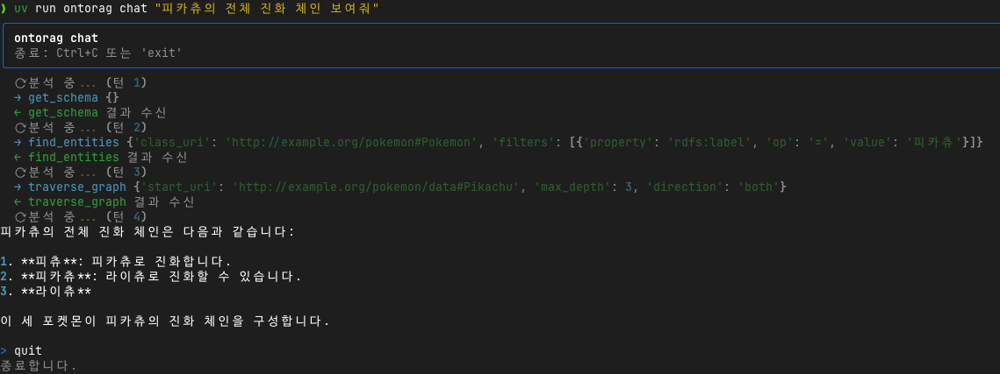
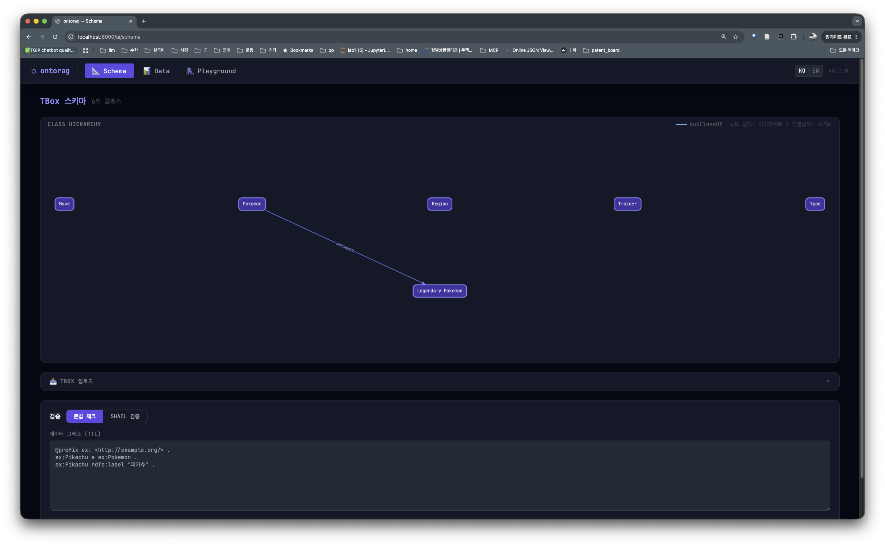
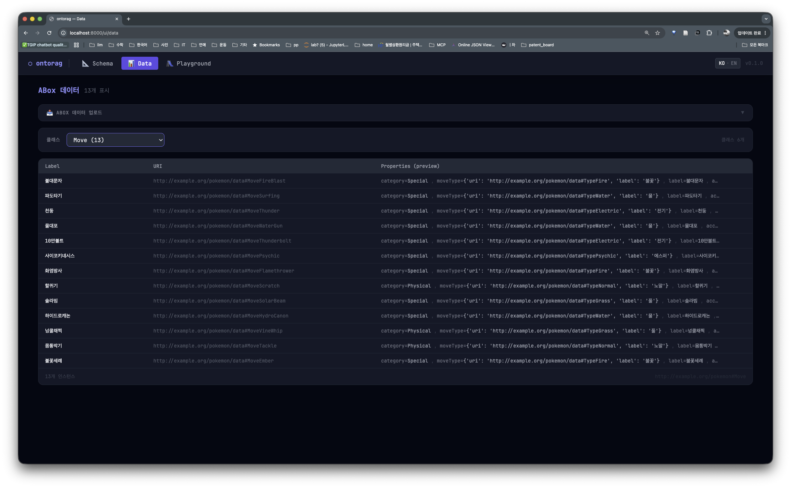
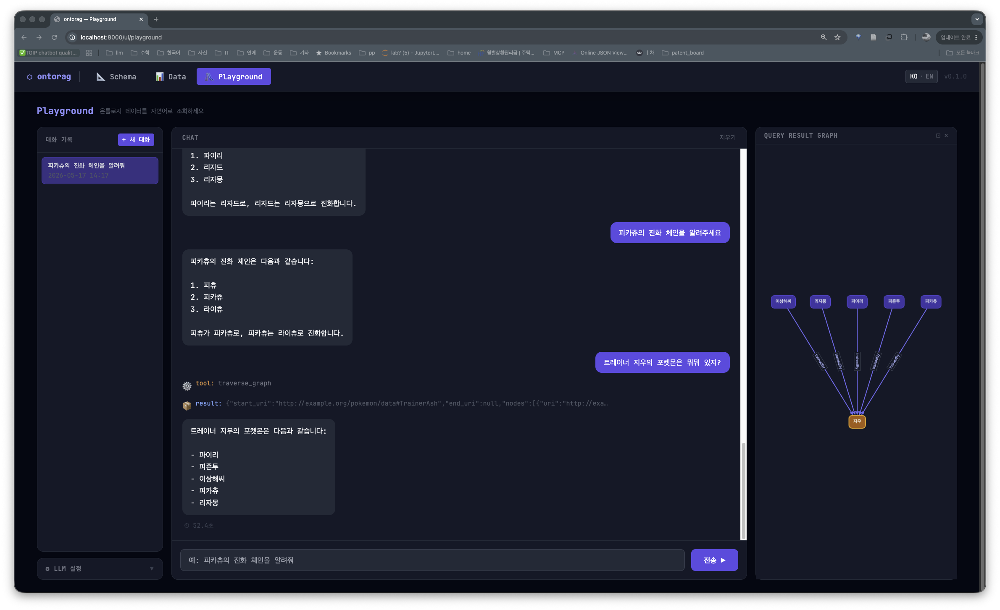

# ontorag

**온톨로지 기반 RAG 프레임워크 — RDF/OWL 온톨로지를 진실의 원천(source of truth)으로.**

[](https://www.python.org)
[](LICENSE)

[English](README.md)

---

일반적인 RAG 시스템은 지식을 텍스트 청크로 저장하고 임베딩 유사도로 검색합니다.
**ontorag**는 온톨로지 자체를 진실의 원천으로 취급합니다. LLM 에이전트가 근사적인 벡터 검색 대신, 구조화된 MCP 툴로 RDF/OWL 그래프를 직접 탐색합니다.

```
사용자 질문 → LLM 에이전트 → 온톨로지 툴 (get_schema / find_entities / traverse_graph …)
                                           ↓
                                Apache Jena Fuseki  (SPARQL 1.1)
                                           ↓
                                  구조화된 JSON 답변
```

---

## 주요 기능

| 기능 | 설명 |
|---|---|
| **온톨로지 중심** | RDF/OWL 스키마(TBox) + 인스턴스 데이터(ABox)를 1등 시민으로 처리 |
| **Agentic MCP 루프** | LLM이 9개의 타입 툴을 호출; 툴 호출 내역이 SSE 스트림에서 실시간 노출 |
| **Web UI** | 브라우저 내장 인터페이스 — 스키마 그래프, 데이터 탐색, Playground 채팅 (`/ui`) |
| **멀티 LLM** | Anthropic Claude · OpenAI · Ollama(로컬) 지원 |
| **GraphStore Protocol** | 추상 인터페이스 — 툴 코드 변경 없이 Fuseki → Neo4j 교체 가능 |
| **SSE 스트리밍** | `thinking / tool_call / tool_result / text / done / rate_limit` 이벤트 |
| **점진적 공개** | `get_schema` (간략) + `get_class_detail` (드릴다운) |
| **인젝션 안전 L2 DSL** | `query_pattern`은 JSON 트리플 패턴을 내부적으로 SPARQL로 변환 |
| **스키마 캐싱** | 세션 시작 시 스키마를 system prompt에 주입 — 매 턴 `get_schema` 호출 불필요 |
| **Docker 우선** | `docker compose up` → 60초 이내 준비 완료 |

---

## 빠른 시작

**사전 요구 사항:** Docker · Docker Compose · Anthropic _또는_ OpenAI API 키

```bash
git clone https://github.com/nuri428/ontorag.git
cd ontorag
cp .env.example .env           # ANTHROPIC_API_KEY (또는 OPENAI_API_KEY) 설정

docker compose up -d           # Fuseki + API 시작

uv run ontorag load schema examples/pokemon/schema.ttl
uv run ontorag load data   examples/pokemon/data.ttl

uv run ontorag chat
```

실행 예시:



---

## Web UI

서버 실행 후 브라우저에서 **http://localhost:8000/ui** 를 열면 됩니다.

### Schema 탭 (TBox)

온톨로지 클래스 계층 구조를 Cytoscape.js 인터랙티브 그래프로 탐색합니다. 노드를 클릭하면 이웃 노드가 하이라이트되고, 더블클릭하면 초기화됩니다. TBox 파일 업로드(항상 교체 모드)와 구문/SHACL 검증을 브라우저에서 바로 실행할 수 있습니다.



### Data 탭 (ABox)

클래스를 선택하면 해당 인스턴스 목록이 표시됩니다. 행을 클릭하면 엔티티의 모든 속성과 depth-2 이웃 그래프가 사이드 패널에 나타납니다. ABox 파일을 **추가** 또는 **교체** 모드로 업로드할 수 있습니다.



### Playground 탭

LLM 에이전트와 채팅합니다. `find_entities`, `traverse_graph` 등 툴 호출이 실행되는 즉시 화면에 표시됩니다. 그래프 데이터가 포함된 응답은 인터랙티브 결과 그래프로 시각화됩니다. 대화 세션 관리와 LLM 제공자 설정을 서버 재시작 없이 UI에서 변경할 수 있습니다.



---

## 아키텍처

```
사용자 (CLI / 브라우저)
  │
  ▼  POST /chat   (SSE 스트림)
┌────────────────────────────────────────┐
│             FastAPI 서버               │
│                                        │
│   /chat ──▶  AgentLoop                 │
│                  │                     │
│        LLM  (Claude / GPT / Ollama)    │
│                  │  tool_use           │
│  ┌───────────────────────────────────┐ │
│  │  L1 의도 툴  (MCP 노출):          │ │
│  │  get_schema        find_entities  │ │
│  │  get_class_detail  describe_entity│ │
│  │  count_entities    traverse_graph │ │
│  │  find_path         find_related   │ │
│  │  L2 DSL:  query_pattern           │ │
│  │  L3 개발:  query_sparql_raw (숨김)│ │
│  └───────────────┬───────────────────┘ │
└──────────────────┼─────────────────────┘
                   │ SPARQL (HTTP)
                   ▼
        Apache Jena Fuseki   ← Phase 1
        Neo4j + n10s         ← Phase 2
```

### SSE 이벤트 타입

| 이벤트 | 페이로드 | 발생 시점 |
|---|---|---|
| `thinking` | `content: str` | LLM 턴 시작 전 |
| `tool_call` | `tool: str, content: dict` | LLM이 툴 호출 |
| `tool_result` | `tool: str, content: any` | 툴 실행 결과 |
| `text` | `content: str` | LLM 최종 답변 청크 |
| `done` | — | 턴 완료 |
| `error` | `content: str` | 복구 불가 오류 |
| `rate_limit` | `retry_after: int` | API 레이트 리밋 도달 — N초 후 재시도 |

---

## 설치

```bash
git clone https://github.com/nuri428/ontorag.git
cd ontorag
uv sync          # 의존성 설치
```

[uv](https://docs.astral.sh/uv/)와 Docker가 필요합니다.

---

## 설정

```bash
# Anthropic (기본값)
ontorag config set --provider anthropic --api-key sk-ant-...

# OpenAI
ontorag config set --provider openai --api-key sk-...

# Ollama (로컬, 키 불필요)
ontorag config set --provider ollama --ollama-url http://localhost:11434

# 모델 변경
ontorag config set --model claude-opus-4-7
ontorag config set --model gpt-4o-mini

# Fuseki 엔드포인트
ontorag config set --fuseki-url http://localhost:3030

# 설정 확인
ontorag config show
```

설정은 현재 디렉터리의 `.env` 파일에 저장됩니다.

### 환경 변수

| 변수 | 기본값 | 설명 |
|---|---|---|
| `LLM_PROVIDER` | `anthropic` | `anthropic` · `openai` · `ollama` |
| `LLM_MODEL` | 제공자 기본값 | 모델 이름 |
| `ANTHROPIC_API_KEY` | — | Anthropic 사용 시 필수 |
| `OPENAI_API_KEY` | — | OpenAI 사용 시 필수 |
| `OLLAMA_BASE_URL` | `http://localhost:11434` | Ollama 서버 주소 |
| `FUSEKI_URL` | `http://localhost:3030` | SPARQL 엔드포인트 |
| `FUSEKI_DATASET` | `ontorag` | 데이터셋 이름 |

---

## CLI 레퍼런스

```bash
ontorag init [DIR]              # 프로젝트 파일 생성 (docker-compose, .env.example, examples)

ontorag load schema <FILE>               # TBox 로드 (클래스/속성 정의)
ontorag load data   <FILE>               # ABox 로드 — 기존 데이터에 추가
ontorag load data   <FILE> --replace     # ABox 로드 — 기존 데이터를 교체
ontorag load        <FILE>               # TBox/ABox 자동 감지

ontorag clear schema                     # TBox(스키마) 그래프 삭제
ontorag clear data                       # ABox(인스턴스) 그래프 삭제
ontorag clear all                        # TBox + ABox 전체 삭제

ontorag serve [--host HOST] [--port PORT] [--reload]

ontorag chat                    # 대화형 REPL

ontorag status                  # 그래프 스토어 연결 + 트리플 수 확인

ontorag config set [OPTIONS]
ontorag config show
```

---

## REST API

### `POST /chat`

```bash
curl -N -X POST http://localhost:8000/chat \
  -H "Content-Type: application/json" \
  -d '{"message": "불꽃 타입 포켓몬 목록을 보여줘"}'
```

```
data: {"type": "thinking",    "content": "분석 중... (턴 1)"}
data: {"type": "tool_call",   "tool": "get_schema",      "content": {}}
data: {"type": "tool_result", "tool": "get_schema",      "content": {...}}
data: {"type": "tool_call",   "tool": "find_entities",   "content": {...}}
data: {"type": "tool_result", "tool": "find_entities",   "content": [...]}
data: {"type": "text",        "content": "불꽃 타입 포켓몬: 파이리, 파이밤, 리자드, ..."}
data: {"type": "done"}
```

### `GET /mcp`

MCP (Model Context Protocol) 엔드포인트. MCP 호환 클라이언트가 연결해 9개의 온톨로지 툴을 직접 호출할 수 있습니다.

---

## MCP 툴 목록

| 툴 | 레이어 | 설명 |
|---|---|---|
| `get_schema` | L1 | 클래스 목록과 속성 수 (~30 tokens/class) |
| `get_class_detail` | L1 | 특정 클래스의 속성·부모·자식·인스턴스 샘플 |
| `find_entities` | L1 | 클래스 + 선택적 조건으로 인스턴스 탐색 |
| `describe_entity` | L1 | 단일 엔티티의 모든 속성과 관계 |
| `count_entities` | L1 | 클래스 인스턴스 수 집계 |
| `traverse_graph` | L1 | 노드에서 BFS 순회 (나가는/들어오는/양방향) |
| `find_path` | L1 | 두 엔티티 간 최단 경로 탐색 |
| `find_related` | L1 | predicate로 연결된 두 클래스 인스턴스 쌍 조회 |
| `query_pattern` | L2 | JSON 트리플 패턴 DSL → 안전한 SPARQL 변환 |

---

## 예제: 포켓몬 온톨로지

번들 예제는 프레임워크의 모든 기능을 실증합니다.

```
examples/pokemon/
├── schema.ttl   # TBox: Pokemon, LegendaryPokemon, Type, Move, Trainer, Region
└── data.ttl     # ABox: 관동 지방 · 포켓몬 12종 · 트레이너 3명 · 타입 18종
```

**온톨로지 설계 포인트:**

- `pk:evolvesFrom` — `owl:TransitiveProperty`로 선언; Fuseki 추론으로 전체 진화 체인 자동 추적
- `pk:LegendaryPokemon rdfs:subClassOf pk:Pokemon` — `find_entities(Pokemon)` 호출 시 뮤츠 자동 포함
- `strongAgainst` / `weakAgainst` — 타입 상성을 오브젝트 프로퍼티로 모델링

**예제 질문:**

```
> 리자몽의 전체 진화 체인을 알려줘
> 지우의 포켓몬은 어떤 것들이야?
> 물 타입에 약한 포켓몬을 찾아줘
> 뮤츠의 전체 스탯을 보여줘
```


---

## LLM 제공자

| 제공자 | 키 변수 | 기본 모델 | 특징 |
|---|---|---|---|
| **Anthropic** (기본값) | `ANTHROPIC_API_KEY` | `claude-sonnet-4-6` | 툴 사용 정확도 최고 |
| **OpenAI** | `OPENAI_API_KEY` | `gpt-4o` | |
| **Ollama** | `OLLAMA_BASE_URL` | `llama3.1` | 로컬 실행, 키 불필요 |

---

## Docker

```bash
# 개발 — 코드 변경 시 자동 재시작
docker compose up

# 프로덕션
docker compose -f docker-compose.yml -f docker-compose.prod.yml up -d
```

| 서비스 | 포트 | 설명 |
|---|---|---|
| `fuseki` | 3030 | Apache Jena Fuseki; 관리 UI: `/dataset.html` |
| `api` | 8000 | ontorag FastAPI; OpenAPI: `/docs`, MCP: `/mcp` |

---

## 타 프레임워크 비교

| 프레임워크 | 온톨로지 | 에이전트 | 비고 |
|---|---|---|---|
| LangChain / LlamaIndex | 최소 지원 | Yes | 코드 중심 RAG, 온톨로지 플러그인 수준 |
| Dify | 미지원 | Yes | 비주얼 빌더, OWL 미지원 |
| GraphRAG (Microsoft) | 텍스트→KG | Yes | 사용자 정의 온톨로지 약함 |
| **ontorag** | **1등 시민** | **Yes** | RDF/OWL/SPARQL을 기본 구조로 사용 |

---

## 로드맵

- **v0.1** — Fuseki · Anthropic · OpenAI · Ollama · CLI · SSE 스트리밍
- **v0.2** (현재) — Web UI (Schema/Data/Playground) · 브라우저 RDF 업로드 · 레이트 리밋 UX · 온톨로지 데이터 존재 시 툴 호출 강제
- **v0.3** — Neo4j + n10s 어댑터 · `GRAPH_STORE` 환경 변수 · 벡터 유사도 툴 (`find_similar`) · 멀티 온톨로지 지원

---

## 기여하기

```bash
# 개발 환경 설정
uv sync --extra dev

# 테스트 실행
uv run pytest tests/ --cov=src/ontorag

# 개발 서버 실행
uv run ontorag serve --reload
```

---

## 라이선스

[MIT](LICENSE)
