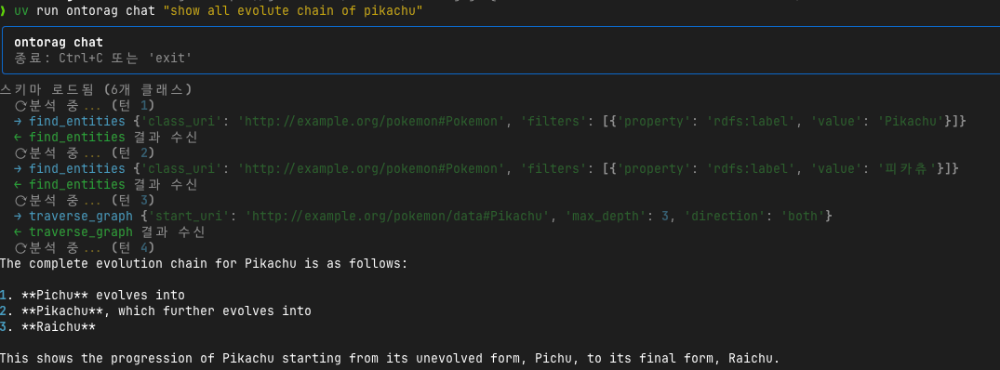
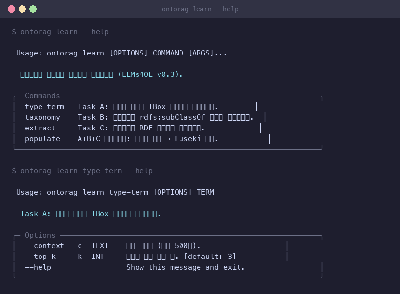
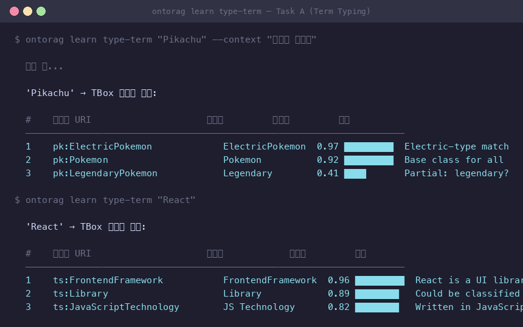
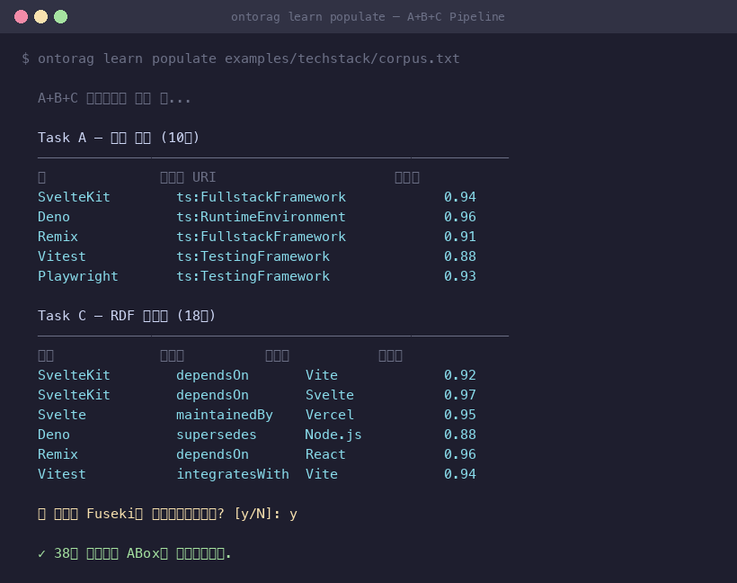
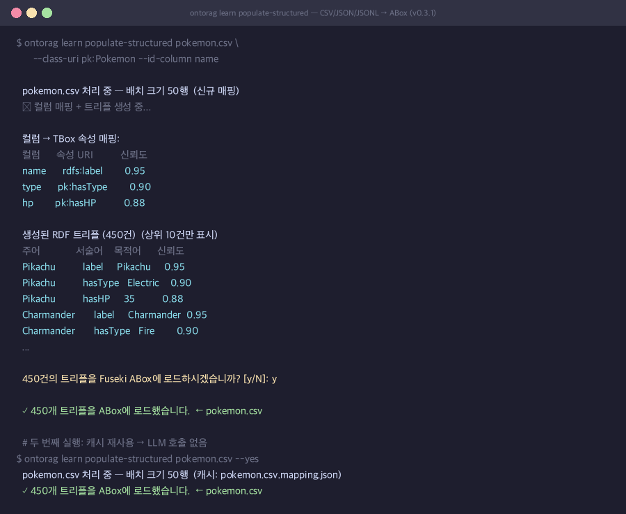
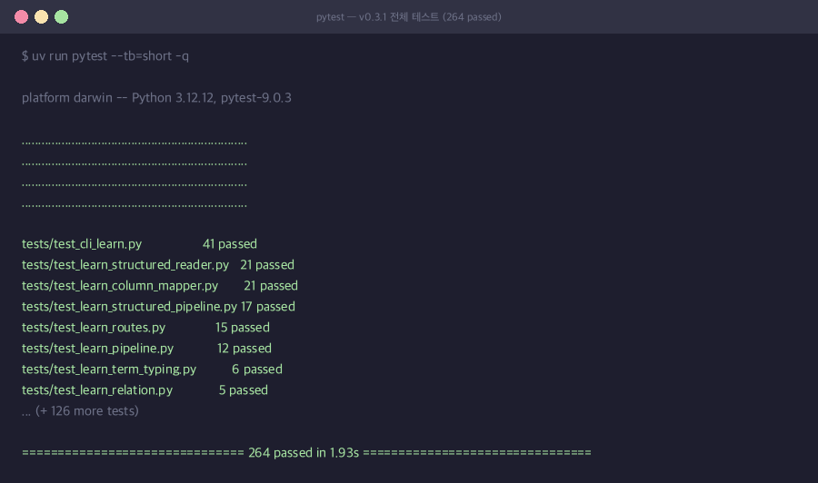

# ontorag

**Ontology-aware RAG framework — RDF/OWL as the source of truth.**

[](https://www.python.org)
[](LICENSE)

[한국어 문서](README.ko.md)

---

Most RAG systems treat knowledge as flat text chunks searched by embedding similarity.
**ontorag** treats the ontology as the source of truth: an LLM agent navigates your RDF/OWL graph using structured MCP tools rather than approximate vector search.

```
User query → LLM agent → ontology tools (get_schema / find_entities / traverse_graph …)
                                      ↓
                              Apache Jena Fuseki  (SPARQL 1.1)
                                      ↓
                         Structured JSON answers
```

---

## Why ontorag (vs. vector RAG)

Measured on identical TBox + ABox + goldsets — see [BENCHMARK_RESULTS.md](BENCHMARK_RESULTS.md) for the full run (LangChain + Chroma + OpenAI, 70 questions across 2 domains).

| Capability | Vector RAG (LangChain) | ontorag |
|---|---|---|
| Single-entity lookup | ✓ Commerce easy 5/5 | ✓ |
| Multi-hop / OWL transitive inference (`pl:locatedIn+`) | ✗ Q008/Q039/Q040 stopped at first hop | ✓ |
| Triple-level citation (auditable provenance) | ✗ 0 / 70 (structural — chunks only) | ✓ 30 / 70 cited |
| Hallucination measurability against ground truth | N/A (no triple-level grounding) | ✓ 0.000 hallucination rate |
| Refusal on KG-absent facts (trap questions) | ✓ Commerce 3/3 traps refused | ✓ |

Vector RAG handles flat lookups well — the structural advantage of ontorag appears on **transitive inference**, **provenance**, and **measurable grounding**.

---

## Key features

| Feature | Detail |
|---|---|
| **Ontology-first** | RDF/OWL schema (TBox) + instance data (ABox) as primary structure |
| **Agentic MCP loop** | LLM calls 9 typed tools; tool calls visible in SSE stream |
| **Web UI** | Built-in browser interface — Schema graph, Data browser, Playground chat at `/ui` |
| **Multi-LLM** | Anthropic Claude · OpenAI · Ollama (local) |
| **GraphStore Protocol** | Abstract interface — swap Fuseki → Neo4j without changing tool code |
| **SSE streaming** | `thinking / tool_call / tool_result / text / done / rate_limit` events |
| **Progressive disclosure** | `get_schema` (compact) + `get_class_detail` (drill-down) |
| **Injection-safe L2 DSL** | `query_pattern` translates JSON triple patterns to SPARQL internally |
| **Schema caching** | Schema injected into system prompt at session start — no `get_schema` call per turn |
| **Docker first** | `docker compose up` → ready in < 60 s |

---

## Quickstart

**Prerequisites:** Docker · Docker Compose · Anthropic _or_ OpenAI API key

```bash
git clone https://github.com/nuri428/ontorag.git
cd ontorag
cp .env.example .env           # set ANTHROPIC_API_KEY (or OPENAI_API_KEY)

docker compose up -d           # starts Fuseki + API

uv run ontorag load schema examples/pokemon/schema.ttl
uv run ontorag load data   examples/pokemon/data.ttl

uv run ontorag chat
```

Example session:



---

## Web UI

After starting the server, open **http://localhost:8000/ui** in your browser.

### Schema tab (TBox)

Browse the ontology class hierarchy as an interactive Cytoscape.js graph. Click a node to highlight its neighbourhood; double-click to reset. Upload TBox files (always replace) and run syntax / SHACL validation directly in the browser.


### Data tab (ABox)

Select a class from the dropdown to browse its instances. Click any row to open an entity detail panel showing all properties and a depth-2 neighbourhood graph. Upload ABox files with **append** or **replace** mode.


### Playground tab

Chat with the LLM agent. Tool calls (`find_entities`, `traverse_graph`, …) are shown in real time as they execute. Query results that contain graph data render as an interactive result graph. Manage conversation sessions and configure the LLM provider without restarting the server.


---

## Architecture

```
User  (CLI / browser)
  │
  ▼  POST /chat   (SSE stream)
┌────────────────────────────────────────┐
│             FastAPI Server             │
│                                        │
│   /chat ──▶  AgentLoop                 │
│                  │                     │
│        LLM  (Claude / GPT / Ollama)    │
│                  │  tool_use           │
│  ┌───────────────────────────────────┐ │
│  │  L1 intent tools  (MCP exposed):  │ │
│  │  get_schema        find_entities  │ │
│  │  get_class_detail  describe_entity│ │
│  │  count_entities    traverse_graph │ │
│  │  find_path         find_related   │ │
│  │  L2 DSL:  query_pattern           │ │
│  │  L3 dev:  query_sparql_raw (hide) │ │
│  └───────────────┬───────────────────┘ │
└──────────────────┼─────────────────────┘
                   │ SPARQL (HTTP)
                   ▼
        Apache Jena Fuseki   ← v0.1–v0.3.2
        Neo4j + n10s         ← v0.5
```

### SSE event types

| Event | Payload | When |
|---|---|---|
| `thinking` | `content: str` | Before each LLM turn |
| `tool_call` | `tool: str, content: dict` | LLM requested a tool |
| `tool_result` | `tool: str, content: any` | Tool returned |
| `text` | `content: str` | LLM final answer chunk |
| `done` | — | Turn complete |
| `error` | `content: str` | Unrecoverable error |
| `rate_limit` | `retry_after: int` | API rate limit hit — retrying in N seconds |

---

## Installation

```bash
git clone https://github.com/nuri428/ontorag.git
cd ontorag
uv sync          # installs all dependencies
```

Requires [uv](https://docs.astral.sh/uv/) and Docker.

---

## Configuration

```bash
# Anthropic (default)
ontorag config set --provider anthropic --api-key sk-ant-...

# OpenAI
ontorag config set --provider openai --api-key sk-...

# Ollama (local, no key required)
ontorag config set --provider ollama --ollama-url http://localhost:11434

# Override model
ontorag config set --model claude-opus-4-7
ontorag config set --model gpt-4o-mini

# Fuseki endpoint
ontorag config set --fuseki-url http://localhost:3030

# Inspect
ontorag config show
```

Settings are written to `.env` in the current directory.

### Environment variables

| Variable | Default | Description |
|---|---|---|
| `LLM_PROVIDER` | `anthropic` | `anthropic` · `openai` · `ollama` |
| `LLM_MODEL` | provider default | Model name |
| `ANTHROPIC_API_KEY` | — | Required for Anthropic |
| `OPENAI_API_KEY` | — | Required for OpenAI |
| `OLLAMA_BASE_URL` | `http://localhost:11434` | Ollama server |
| `FUSEKI_URL` | `http://localhost:3030` | SPARQL endpoint |
| `FUSEKI_DATASET` | `ontorag` | Dataset name |

---

## CLI reference

```bash
ontorag init [DIR]              # Scaffold project files (docker-compose, .env.example, examples)

ontorag load schema <FILE>               # Load TBox (class / property definitions)
ontorag load data   <FILE>               # Load ABox — appends to existing data
ontorag load data   <FILE> --replace     # Load ABox — replaces existing data
ontorag load        <FILE>               # Auto-detect TBox vs ABox

ontorag clear schema                     # Drop TBox graph
ontorag clear data                       # Drop ABox graph
ontorag clear all                        # Drop both graphs

ontorag serve [--host HOST] [--port PORT] [--reload]

ontorag chat                    # Interactive REPL

ontorag status                  # Graph store connection + triple counts

ontorag config set [OPTIONS]
ontorag config show

# v0.3 — Ontology learning from text
ontorag learn type-term "React"                        # Task A — map term to TBox class
ontorag learn taxonomy corpus.txt                      # Task B — propose rdfs:subClassOf
ontorag learn extract corpus.txt                       # Task C — extract RDF triples
ontorag learn populate corpus.txt [--yes]              # A+B+C pipeline → Fuseki

# v0.3.1 — Structured ABox population (CSV / JSON / JSONL)
ontorag learn populate-structured data.csv \
    --class-uri pk:Pokemon --id-column name [--yes]
ontorag learn populate-structured data.jsonl --batch-size 100 --yes
ontorag learn populate-structured nested.json --min-confidence 0.8
```

---

## REST API

### `POST /chat`

```bash
curl -N -X POST http://localhost:8000/chat \
  -H "Content-Type: application/json" \
  -d '{"message": "List all Fire-type Pokémon"}'
```

```
data: {"type": "thinking",    "content": "Analysing... (turn 1)"}
data: {"type": "tool_call",   "tool": "get_schema",      "content": {}}
data: {"type": "tool_result", "tool": "get_schema",      "content": {...}}
data: {"type": "tool_call",   "tool": "find_entities",   "content": {...}}
data: {"type": "tool_result", "tool": "find_entities",   "content": [...]}
data: {"type": "text",        "content": "Fire-type Pokémon: Charmander, ..."}
data: {"type": "done"}
```

### `GET /mcp`

MCP (Model Context Protocol) endpoint. Any MCP-compatible client can connect and call the 9 ontology tools directly.

---

## MCP tools

| Tool | Layer | Description |
|---|---|---|
| `get_schema` | L1 | Class list with property counts (~30 tokens/class) |
| `get_class_detail` | L1 | Properties, parents, children, instance sample |
| `find_entities` | L1 | Filter instances by class + optional predicates |
| `describe_entity` | L1 | All properties and relationships of one entity |
| `count_entities` | L1 | Instance count for a class |
| `traverse_graph` | L1 | BFS from a node (outgoing / incoming / both) |
| `find_path` | L1 | Shortest path between two entities |
| `find_related` | L1 | Cross-class join via a predicate |
| `query_pattern` | L2 | JSON triple-pattern DSL → safe SPARQL translation |

---

## v0.3 — LLMs4OL: Ontology Learning from Text

v0.3 adds the **LLMs4OL pipeline** — an LLM reads plain text and proposes RDF triples that extend the live ontology. No manual authoring required.

### CLI commands



### Task A — Term Typing (`type-term`)

Maps a text mention to the best-matching TBox class, with confidence scores and reasoning.

```bash
ontorag learn type-term "Pikachu" --context "evolved Pokémon"
ontorag learn type-term "React"
```



### A+B+C Pipeline (`populate`)

Runs all three tasks in sequence — Term Typing → Taxonomy Discovery → Relation Extraction — then optionally loads the accepted triples into Fuseki.

```bash
ontorag learn populate examples/techstack/corpus.txt
```



### Structured ABox Population (`populate-structured`) — v0.3.1

Reads a **CSV / JSON / JSONL** file, maps columns to TBox property URIs via LLM, and converts each row into RDF triples. The column mapping is cached in a sidecar `.mapping.json` file — subsequent runs reuse it without any LLM call.

```bash
# First run: LLM maps columns → saves pokemon.csv.mapping.json
ontorag learn populate-structured pokemon.csv \
    --class-uri pk:Pokemon --id-column name

# Second run: mapping reused, zero LLM calls
ontorag learn populate-structured pokemon.csv --yes

# JSON / JSONL (nested keys are flattened: {"stats":{"hp":35}} → "stats.hp")
ontorag learn populate-structured pokedex.jsonl --batch-size 100 --yes
```



| Option | Default | Description |
|---|---|---|
| `--class-uri` | — | TBox class URI for each row (e.g. `pk:Pokemon`) |
| `--id-column` | — | Column to use as subject URI slug; uuid5 if omitted |
| `--batch-size` | 50 | Rows per LLM mapping call |
| `--min-confidence` | 0.7 | Minimum column-mapping confidence threshold |
| `--yes` | false | Skip Fuseki load confirmation prompt |

### Test suite — v0.3.1 (264 tests)



---

## Example: Tech Stack ontology (v0.3 — LLMs4OL)

This example shows what a plain vector-search RAG cannot do.

**Step 1 — load a seed ontology** (15 technologies: React, Next.js, Node.js, TypeScript, …)

```bash
uv run ontorag load schema examples/techstack/schema.ttl
uv run ontorag load data   examples/techstack/data.ttl
```

**Step 2 — extend it from plain text** using the v0.3 LLMs4OL pipeline

```bash
# Feed a text corpus → LLM extracts types + relations → propose RDF triples
uv run ontorag learn populate examples/techstack/corpus.txt
```

**Step 3 — query the expanded graph** — OWL transitive reasoning included

```
> What does Next.js depend on?
```
Answer: Next.js → React → Node.js  
*(Next.js dependsOn Node.js was never written — Fuseki infers it via `owl:TransitiveProperty`.)*

```
> List all fullstack frameworks that depend on Vite
> Which tools supersede an existing technology?
> What technologies are maintained by Vercel?
```

See [`examples/techstack/README.md`](examples/techstack/README.md) for the full walkthrough.

---

## Example: Pokémon ontology

The bundled example exercises every feature of the framework.

```
examples/pokemon/
├── schema.ttl   # TBox: Pokemon, LegendaryPokemon, Type, Move, Trainer, Region
└── data.ttl     # ABox: Kanto region · 12 Pokémon · 3 Trainers · 18 Types
```

**Ontology highlights:**

- `pk:evolvesFrom` — declared `owl:TransitiveProperty`; Fuseki inference follows full chains
- `pk:LegendaryPokemon rdfs:subClassOf pk:Pokemon` — `find_entities(Pokemon)` includes Mewtwo automatically
- `strongAgainst` / `weakAgainst` — type effectiveness modelled as object properties

**Sample queries:**

```
> Show the full evolution chain of Venusaur
> Which Pokémon does Ash own?
> Find all Pokémon weak to Water type
> What are Mewtwo's stats?
```


---

## LLM providers

| Provider | Key variable | Default model | Notes |
|---|---|---|---|
| **Anthropic** (default) | `ANTHROPIC_API_KEY` | `claude-sonnet-4-6` | Best tool-use accuracy |
| **OpenAI** | `OPENAI_API_KEY` | `gpt-4o` | |
| **Ollama** | `OLLAMA_BASE_URL` | `llama3.1` | Local, no key needed |

---

## Docker

```bash
# Development — hot reload enabled
docker compose up

# Production
docker compose -f docker-compose.yml -f docker-compose.prod.yml up -d
```

| Service | Port | Notes |
|---|---|---|
| `fuseki` | 3030 | Apache Jena Fuseki; admin UI at `/dataset.html` |
| `api` | 8000 | ontorag FastAPI; OpenAPI at `/docs`, MCP at `/mcp` |

---

## Comparison

| Framework | Ontology | Agent | Notes |
|---|---|---|---|
| LangChain / LlamaIndex | Minimal | Yes | Code-first RAG, ontology is a plugin |
| Dify | None | Yes | Visual builder, no OWL support |
| GraphRAG (Microsoft) | Property graph from text | Yes | No OWL semantics — no `rdfs:subClassOf` inference, no `owl:TransitiveProperty`, no SPARQL; schema not enforced at query time |
| **ontorag** | **OWL-native** | **Yes** | TBox defines schema; Fuseki enforces OWL reasoning; v0.3 adds LLMs4OL (text → ontology extension) |

---

## Evaluation Harness — `ontorag eval`

A built-in evaluation harness for comparing ontorag against vector RAG
baselines on benchmark goldsets. Available on the `eval-harness` branch.

### What it provides

- **Two benchmark domains** — `examples/pure_land/` (50 questions, fictional+religious — Sukhāvatī cosmology with multilingual labels) and `examples/commerce/` (20 questions, schema.org real vocabulary with fictional companies)
- **Goldset format** — JSONL with `gold_sparql`, `gold_answer`, `gold_triples`, `uses_inference` per question. Pydantic-validated.
- **5 metrics** — `sparql_result_equivalent`, `inference_utilization`, `hallucination_rate`, `citation_coverage`, plus RAGAS (`faithfulness`, `answer_correctness`, `answer_relevancy`)
- **Baselines** — `ontorag_mock` (perfect retrieval upper bound), `vector_rag_mock` (lossy 70/20/10 bucket simulation), `langchain` (real RetrievalQA + Chroma + OpenAI — `--extra bench` + API key)
- **Markdown reports** — automatic generation suitable for PR comments / blog posts
- **CI integration** — GitHub Actions matrix runs both domains on every PR; report uploaded as artifact + posted as sticky comment

### Commands

```bash
# Validate a goldset
uv run ontorag eval validate examples/commerce/goldset.jsonl

# Run gold_sparql against schema+data (data hygiene check)
uv run ontorag eval run examples/commerce/goldset.jsonl \
    --schema examples/commerce/schema.ttl \
    --data examples/commerce/data.ttl \
    --output report.json

# End-to-end bench with a baseline + metrics
uv run ontorag eval bench examples/commerce/goldset.jsonl \
    --baseline ontorag_mock \
    --schema examples/commerce/schema.ttl \
    --data examples/commerce/data.ttl \
    --output ontorag.json

# Side-by-side comparison Markdown
uv run ontorag eval compare ontorag.json langchain.json \
    --name-a ontorag --name-b langchain \
    --output comparison.md

# Markdown report from JSON
uv run ontorag eval report ontorag.json --output report.md
```

### Real LangChain baseline + RAGAS (~$1 / run)

```bash
uv sync --extra bench
export OPENAI_API_KEY=sk-...

uv run ontorag eval bench examples/commerce/goldset.jsonl \
    --baseline langchain \
    --schema examples/commerce/schema.ttl \
    --data examples/commerce/data.ttl \
    --with-ragas \
    --output langchain_real.json
```

See [`BENCHMARK_RESULTS.md`](BENCHMARK_RESULTS.md) for the full
multi-iteration history and an honest accounting of what is and isn't
proven.

---

## Benchmark results — 4-domain RAGAS final (2026-05)

We ran a head-to-head benchmark across **four ontology domains** with
both **agent = `gpt-4o`** and **judge = `gpt-4o`** (RAGAS LLM-as-judge).
The two baselines compared are:

| Baseline | What it does |
|---|---|
| `langchain` | Classic vector RAG — Chroma index over TTL chunks + OpenAI embeddings + `gpt-4o` RetrievalQA. No graph reasoning. |
| `ontorag_native` | ontorag's own agent loop — `gpt-4o` calling 9 ontology-aware MCP tools backed by Apache Jena Fuseki with OWL inference. |

### The four domains — designed to cover different OWL feature mixes

| Domain | Questions | Lang | OWL feature mix | LLM contamination |
|---|---|---|---|---|
| **Pokemon** | 20 | Korean | 1 TransitiveProperty (`evolvesFrom`), small ABox (~50 instances) | Very high — every frontier LLM was pre-trained on Gen-1 Pokemon |
| **Techstack** | 20 | Korean | 1 TransitiveProperty (`dependsOn`), small ABox (15 technologies) | Very high — React/Node.js/TypeScript everywhere |
| **ODS** (Open Data Structures) | 20 | English | 2 TransitiveProperty (`uses`, `specialises`) + 1 inverseOf pair (`implements` ↔ `implementedBy`) | High — Pat Morin's open textbook |
| **Pure Land** | 50 | Korean | TransitiveProperty (`locatedIn`) + multilingual labels (`@ko/@zh-Hant/@en`) + large ABox (717 triples) | Low — Sukhāvatī cosmology, fictional+religious |

The four domains were deliberately chosen to vary along two axes — how
**OWL-feature-rich** the ontology is, and how much the LLM has already
**seen the answers during pre-training**.

### The numbers

For each (domain, baseline) pair we measured three RAGAS LLM-as-judge
metrics (Faithfulness, AnswerCorrectness, AnswerRelevancy) plus two
deterministic metrics (Hallucination rate from SPARQL evidence,
Citation provision rate). Values in **bold** are the within-domain
winner.

| Domain | Baseline | Faithfulness | Correctness | Relevancy | Hallucination | Citation% |
|---|---|---|---|---|---|---|
| Pokemon | LangChain | **0.677** | 0.448 | 0.342 | — | 0% |
| Pokemon | ontorag_native | 0.423 | **0.466** | **0.349** | **0.000** | **65%** |
| Techstack | LangChain | **0.808** | **0.523** | **0.420** | — | 0% |
| Techstack | ontorag_native | 0.333 | 0.382 | 0.279 | **0.000** | **45%** |
| ODS | LangChain | 0.521 | 0.493 | 0.641 | — | 0% |
| ODS | ontorag_native | **0.551** | **0.515** | **0.749** | **0.000** | **65%** |
| Pure Land | LangChain | 0.345 | 0.260 | 0.180 | — | 0% |
| Pure Land | ontorag_native | **0.422** | **0.381** | **0.357** | **0.000** | **66%** |

### How to read the table — three findings

#### Finding 1. LLM-judge Faithfulness has a chunk-quote style bias

In Pokemon and Techstack, LangChain wins Faithfulness by a large margin
(0.677 and 0.808). This is **not** evidence that LangChain produces
truer answers — it's evidence that the RAGAS judge rewards answers
whose wording overlaps with the retrieved chunks. LangChain literally
quotes the source TTL text, so the overlap is high.

ontorag_native, by contrast, **runs SPARQL and translates the result
into a fluent answer**. The factual content can be identical, but the
phrasing diverges from the source — so the judge penalizes it.

You can confirm this is a *style* difference rather than a *factual*
difference by looking at the next two metrics: in Pokemon, ontorag's
**AnswerCorrectness is actually higher** (0.466 vs 0.448) and so is
**AnswerRelevancy** (0.349 vs 0.342). Same facts, different style.

#### Finding 2. The richer the OWL feature set, the bigger ontorag's edge

Compare the four domains by how many independent OWL features the TBox
exercises:

| Domain | TransitiveProperty | inverseOf | Multilingual | Domains ontorag wins (5 metrics) |
|---|---|---|---|---|
| Pokemon | 1 | ✗ | ✗ | 3 of 5 |
| Techstack | 1 | ✗ | ✗ | 2 of 5 |
| ODS | 2 | ✓ | ✗ | 5 of 5 |
| Pure Land | 1 | ✓ | ✓ | 5 of 5 |

When the ontology only exercises **one axis of OWL inference**
(Pokemon, Techstack), vector RAG's chunk-quote advantage holds on the
style metrics. When the ontology exercises **two or more axes** (ODS's
two TransProps + inverseOf; Pure Land's transitive locatedIn +
multilingual labels + large ABox), graph reasoning starts winning
*every* RAGAS metric — including Faithfulness.

The most dramatic case is Pure Land. AnswerRelevancy jumps from 0.180
(LangChain) to 0.357 (ontorag), a **98% relative improvement**. Why?
Because the question and the gold answer can be in different
languages, and the URI links them — but the vector index sees them as
unrelated chunks.

##### Decision grid — where each domain sits

Plotting the four domains on a 2×2 of *OWL richness* × *LLM
contamination* makes the trade-off visible at a glance:

```
                           OWL richness  →
                      low                       high
                  ┌──────────────────┬──────────────────┐
                  │                  │                  │
        low       │                  │   ★ Pure Land    │
                  │                  │   ★ ODS          │
                  │                  │                  │
  contamination   ├──────────────────┼──────────────────┤
                  │                  │                  │
        high      │   ★ Pokemon     │   ★ Techstack   │
                  │                  │                  │
                  └──────────────────┴──────────────────┘
                  ontorag             ontorag wins every
                  Correctness/        RAGAS metric +
                  Relevancy ↑,        always wins
                  LangChain           Hallucination 0%
                  Faithfulness ↑      and Citation 45-66%
```

Pure Land sits in the **upper-right** alongside ODS — its TransProp +
inverseOf + multilingual labels make it OWL-rich, and its
fictional+religious cosmology makes it the least-contaminated of the
four. That cell is where ontorag's advantage is largest (Pure Land
AnswerRelevancy +98% relative; ODS Relevancy +17% absolute).

The **lower-right** (Techstack) is the *adversarial* cell for ontorag
on RAGAS scores — high contamination plus a small ABox plays directly
to the chunk-quote style bias. The **lower-left** (Pokemon) is the
*split decision* cell: LangChain wins style metrics, ontorag wins
factual metrics. The **upper-left** is intentionally empty — that
combination (low OWL features + low contamination) is rare in
practice; if you're not exercising graph reasoning *and* the LLM
hasn't memorized your domain, you probably just need a Q&A bot, not a
RAG stack.

#### Finding 3. Hallucination 0% and Citation 45-66% — only ontorag

Look at the rightmost two columns: across **all four domains**,
ontorag has a **Hallucination rate of exactly 0.000** and Citation
provision rates between 45% and 66%. LangChain shows "—" in both — and
this needs an explanation, because "—" is **not** the same as "0".

The two metrics are *deterministic* (not LLM-judged): the harness
parses each answer for explicit triple/URI citations, then checks each
cited triple against the actual ABox.

* `citation_provided_rate` = "did the answer cite anything?"
* `citation_coverage` = "of those citations, what fraction match a real
  ABox triple?"
* `hallucination_rate` = "of those citations, what fraction reference
  triples that do **not** exist in the ABox?"

All three require step 1 — **the answer must emit citations** — before
step 2 can compute anything. LangChain's `RetrievalQA` chain feeds
chunks to the LLM as prompt context and returns prose only; it never
emits RDF triples. So:

* `citation_provided_rate = 0%` is a real measurement (the baseline
  produced no citations on any of the 110 questions).
* `hallucination_rate = "—"` is **"not measurable"**, not "zero". With
  no citations to verify, the falsifiable test has no input — saying
  the rate is 0 would be a false claim of safety.

ontorag's agent loop, by contrast, runs SPARQL through MCP tools and
attaches the result triples as evidence inside the answer. The harness
extracts and verifies them, which is why the same columns *do*
populate for ontorag — and they all clear the bar (0 hallucinations,
45-66% of answers cited at least one triple).

**This is the structural moat that does not depend on the LLM judge.**
If your application is in a domain where producing a confident wrong
answer is expensive — legal, medical, scholarly KGs, multi-locale
catalogs — this is where the value lives. Each goldset includes 20%
**trap questions** (entities the LLM has seen in pre-training but that
are absent from the ontology, e.g. *Eevee* / *Vue.js* / *SplayTree* /
*Mew*); ontorag refuses to answer instead of hallucinating, because
SPARQL returns empty rows and the agent honors that.

> **Want a comparable proxy for LangChain?** RAGAS Faithfulness in
> column 3 is the closest LLM-judged equivalent — but it gives you a
> *fuzzy similarity score*, not a *falsifiable yes/no* check against
> the actual graph.

### Practical takeaway

| If your domain is... | Pick |
|---|---|
| Heavy contamination + small ABox + style/quote matters | **LangChain** wins RAGAS scores; ~$0.45/run |
| Rich OWL features (≥2 TransProps, inverseOf, or multilingual) | **ontorag** wins every RAGAS metric |
| Hallucination cost > retrieval cost (legal/medical/scholarly) | **ontorag** — it refuses instead of fabricating |
| You need to point at the exact triple that produced an answer | **ontorag** — only baseline that cites |

Full per-question breakdown and the v2→v9 iteration history are in
[`BENCHMARK_RESULTS.md`](BENCHMARK_RESULTS.md). Per-domain analyses
live in each `examples/<domain>/README.md`.

### Reproducing

```bash
docker compose up -d                           # Fuseki
cp .env.example .env && edit OPENAI_API_KEY    # OpenAI key required
echo "LLM_MODEL=gpt-4o"            >> .env     # agent model
echo "RAGAS_JUDGE_MODEL=gpt-4o"    >> .env     # judge model (opt-in)

# For each domain — clear graph, reload, run two baselines:
uv run ontorag load schema examples/pokemon/schema.ttl
uv run ontorag load data   examples/pokemon/data.ttl

uv run ontorag eval bench examples/pokemon/goldset.jsonl \
    --baseline langchain      --schema examples/pokemon/schema.ttl \
    --data examples/pokemon/data.ttl --lang ko --with-ragas \
    --output examples/pokemon/bench_results/langchain_gpt4o.json

uv run ontorag eval bench examples/pokemon/goldset.jsonl \
    --baseline ontorag_native --schema examples/pokemon/schema.ttl \
    --data examples/pokemon/data.ttl --lang ko --with-ragas \
    --output examples/pokemon/bench_results/ontorag_native_gpt4o.json
```

Approximate cost: ~$7-9 for the full 4-domain × 2-baseline run with
`gpt-4o` on both agent and judge.

---

## Roadmap

- **v0.1** — Fuseki · Anthropic · OpenAI · Ollama · CLI · SSE streaming ✅
- **v0.2** — Web UI (Schema/Data/Playground) · RDF upload from browser · Rate-limit UX · Forced tool-use when ontology has data ✅
- **v0.3** — LLMs4OL: `ontorag learn` CLI (Term Typing · Taxonomy Discovery · Relation Extraction) · `type_term` + `extract_triples` MCP tools · Tech Stack example ✅
- **v0.3.1** — Structured ABox population: `populate-structured` reads CSV/JSON/JSONL → maps columns to TBox via LLM → RDF triples → Fuseki; mapping cache, uuid5 idempotent URIs, batch checkpointing ✅
- **v0.3.2** — TBox/ABox dump: `ontorag dump schema|data|all` · `GET /dump` REST endpoint · Web UI download buttons · TTL / JSON / JSONL / XLSX formats ✅
- **v0.4 (eval-harness branch, current)** — Phase B evaluation harness: 2 benchmark domains (Pure Land 50q + Commerce 20q) · Goldset JSONL + Pydantic loader · 4 deterministic metrics + RAGAS wrapper · LangChain vector baseline · `ontorag eval` CLI (validate/run/bench/compare/report) · GitHub Actions matrix CI · BenchRunner orchestrator ✅
- **v0.5** — Neo4j + n10s adapter · `GRAPH_STORE` env var · Vector similarity tool (`find_similar`) · Multi-ontology support

---

## Contributing

```bash
# Set up dev environment
uv sync --extra dev

# Run tests
uv run pytest tests/ --cov=src/ontorag

# Run the API in dev mode
uv run ontorag serve --reload
```

---

## License

[MIT](LICENSE)
