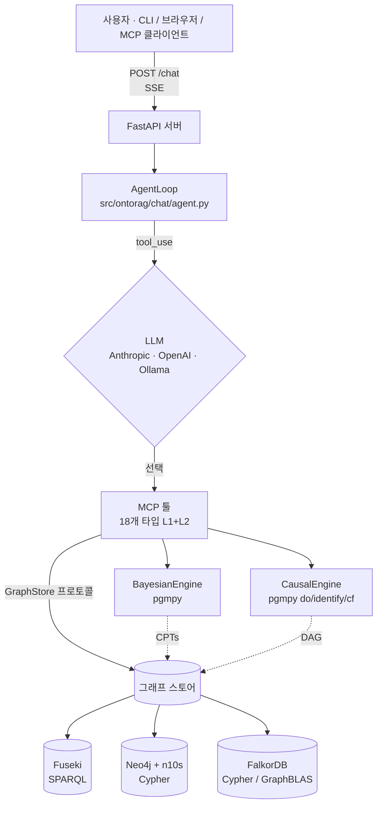
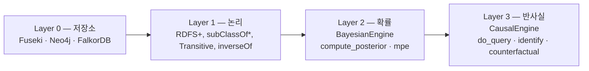

# 아키텍처

ontorag는 단일 FastAPI 프로세스입니다. 에이전트 루프가 사용자 메시지를 읽고,
LLM에게 **타입 MCP 툴**을 선택하게 한 뒤, 그 툴을 교체 가능한
**GraphStore** 위에서 호출하고, 모든 단계를 **Server-Sent Events**로
클라이언트에 스트리밍합니다.



세 가지 설계가 이 구조를 가능케 합니다:

1. **GraphStore 프로토콜** — 모든 툴은 구체 어댑터가 아닌 추상 인터페이스
   (`src/ontorag/stores/base.py`)에 의존합니다. 팩토리(`create_store()`)가
   `GRAPH_STORE`를 읽어 적절한 어댑터를 반환합니다. 3-백엔드 parity가
   현실적으로 가능한 이유 — 한 번 작성한 툴이 모든 백엔드에서 동작합니다.
2. **SSE 투명성** — 툴 호출과 결과가 스트림에 노출됩니다. 에이전트는
   블랙박스가 아니며, 사용자는 *왜* 그 답이 나왔는지 볼 수 있습니다.
3. **명명된 그래프 분리** — 추론 산출물(CPT, 인과 DAG)은 전용 명명된
   그래프(`urn:ontorag:probabilistic`, `urn:ontorag:causal`)에 들어가며,
   스키마/데이터 그래프를 오염시키지 않습니다.

## 4-레이어 추론 스택



각 레이어는 *다른 종류의* 질문에 답합니다 — [추론 레이어](reasoning.md)
참조. 학습 레이어(GNN / R-GCN)는 v1.1+로 연기됨.

## 3-백엔드 레이아웃

| 백엔드 | 와이어 프로토콜 | 저장 기술 | 추론 구현 | 벡터 |
|---|---|---|---|---|
| **Fuseki** | SPARQL 1.1 over HTTP | Apache Jena TDB2 | 쿼리 레벨 `subClassOf*` | Qdrant (외부) |
| **Neo4j + n10s** | Bolt + Cypher | Neo4j 5 | Cypher `[:rdfs__subClassOf*]` | native vector index |
| **FalkorDB** | Redis + OpenCypher | GraphBLAS | 공유된 Neo4j Cypher mixins | native `vecf32()` |

세 백엔드 모두 같은 로드된 RDF를 받아 *동일한* 프로토콜 툴 결과를
반환합니다 — `docs/BENCHMARK_v1.md`에서 검증 (7/7 메트릭 일치).

## 에이전트 루프와 SSE 이벤트

`AgentLoop` (`src/ontorag/chat/agent.py`)가 한 턴을 이끕니다:

1. 사용자 메시지 + 압축 `get_schema` 스냅샷을 히스토리에 추가.
2. 툴 카탈로그와 함께 LLM 호출.
3. LLM이 `tool_use`를 내면 MCP 툴 레이어로 라우팅, `tool_call` +
   `tool_result` 이벤트 방출 후 루프.
4. LLM이 최종 텍스트를 내면 `text` 청크와 마지막 `done` 방출.

클라이언트가 보는 SSE 이벤트:

| 이벤트 | 페이로드 | 시점 |
|---|---|---|
| `thinking` | `content: str` | 각 LLM 턴 직전 |
| `tool_call` | `tool: str, content: dict` | LLM이 툴 요청 |
| `tool_result` | `tool: str, content: any` | 툴 반환 |
| `text` | `content: str` | LLM 최종 답변 청크 |
| `done` | — | 턴 종료 |
| `error` | `content: str` | 복구 불가 에러 |
| `rate_limit` | `retry_after: int` | API 레이트 리밋 — N초 후 재시도 |

## MCP 표면

두 전송이 동일한 핸들러 코드를 공유합니다:

- **HTTP / SSE** (`/mcp`, `fastapi-mcp` 내장) — ontorag가 이미 서버로 실행
  중일 때.
- **stdio** (`ontorag-mcp`, `[mcp]` extra, v1.1) — 클라이언트가 직접
  스폰. 서버 불필요. Claude Desktop / Cursor / Claude Code에 설정 한 줄로
  연결.

전체 툴 카탈로그는 [MCP & 툴](mcp.md) 참조.

## 설정 표면

단일 계층화된 `.env`:

```dotenv
GRAPH_STORE=fuseki                 # fuseki | neo4j | falkordb
FUSEKI_URL=http://localhost:3030/ontorag
FUSEKI_TIMEOUT=60                  # 0 = 무제한
LLM_PROVIDER=anthropic
LLM_MODEL=claude-opus-4-7
LLM_TIMEOUT=60
ANTHROPIC_API_KEY=...
```

`core/config.py:env_timeout()`이 모든 타임아웃 변수를 파싱 — 숫자/미지정 →
기본값, `0` → 무제한, 잘못된 값 → 기본값 + 경고.

## 설계 원칙

- **온톨로지가 단일 진실 원천.** 툴은 온톨로지 구조를 노출하고, 벡터
  유사도는 보조이지 결코 권위가 아닙니다.
- **구조화된 툴 출력.** JSON in, JSON out. LLM은 청크가 아닌 구조 데이터를
  받습니다.
- **Raw SPARQL 미노출.** L3는 `curl` 디버깅 전용. 에이전트는 L1 + L2만
  봅니다.
- **빠른 콜드 스타트.** `docker compose up` → 60초 안에 API 준비.
- **명시 > 암묵.** 설정은 `.env`와 CLI 플래그로, 매직 없음.

## 더 읽기

- [설치](installation.md) — extras 매트릭스.
- [추론 레이어](reasoning.md) — 베이지안 + 인과 상세.
- [벤치마크](benchmark.md) — 3-백엔드 parity 증명.
- 설계 노트 — `docs/design/*` (서브시스템별 결정).
