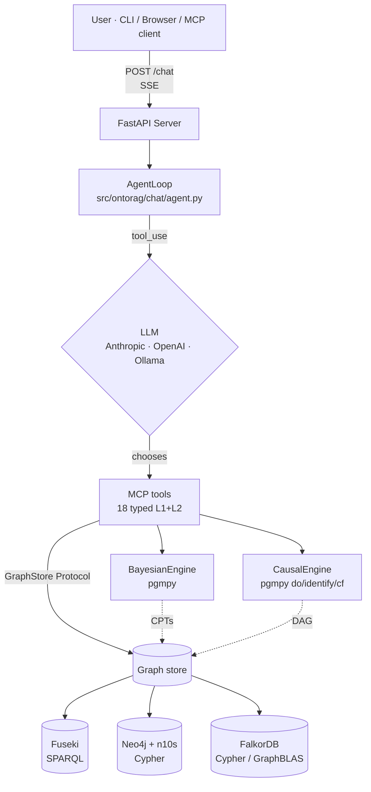
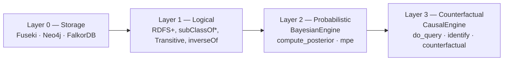
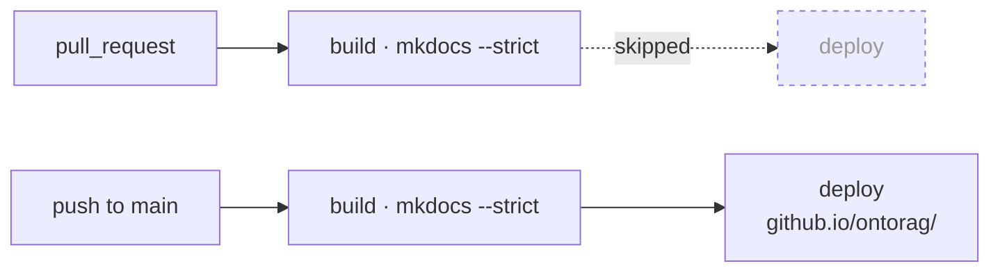

# Architecture

ontorag is a single FastAPI process. An agent loop reads a user message,
asks an LLM to pick **typed MCP tools**, calls those tools against a
swappable **GraphStore**, and streams every step back to the client over
**Server-Sent Events**.



Three things make this layout work:

1. **GraphStore Protocol** — every tool depends on the abstract interface
   (`src/ontorag/stores/base.py`), never on a concrete adapter. The factory
   (`create_store()`) reads `GRAPH_STORE` and returns the matching adapter.
   This is what makes 3-backend parity tractable: write the tool once, get it
   on all backends.
2. **SSE transparency** — tool calls and tool results are visible in the
   stream. The agent is not a black box; the user can see *why* an answer was
   produced.
3. **Named-graph separation** — reasoning artefacts (CPTs, causal DAG) live
   in dedicated named graphs (`urn:ontorag:probabilistic`,
   `urn:ontorag:causal`) — they never pollute the schema/data graphs.

## The 4-layer reasoning stack



Each layer answers a different *kind* of question — see [Reasoning
layer](reasoning.md). A learning layer (GNN / R-GCN) is deferred to v1.1+.

## The 3-backend layout

| Backend | Wire protocol | Storage tech | Reasoning impl | Vector |
|---|---|---|---|---|
| **Fuseki** | SPARQL 1.1 over HTTP | Apache Jena TDB2 | query-level `subClassOf*` | Qdrant (external) |
| **Neo4j + n10s** | Bolt + Cypher | Neo4j 5 | Cypher `[:rdfs__subClassOf*]` | native vector index |
| **FalkorDB** | Redis + OpenCypher | GraphBLAS | shared Neo4j Cypher mixins | native `vecf32()` |

All three accept the same loaded RDF and return *identical* protocol-tool
results — verified by `docs/BENCHMARK_v1.md` (7/7 metrics match).

## Agent loop & SSE events

`AgentLoop` (`src/ontorag/chat/agent.py`) drives a turn:

1. Append the user message + a compact `get_schema` snapshot to history.
2. Call the LLM with the tool catalog.
3. If the LLM emits `tool_use`, route it through the MCP tool layer, emit
   `tool_call` + `tool_result` events, then loop.
4. When the LLM emits final text, emit `text` chunks and finally `done`.

SSE events visible to the client:

| Event | Payload | When |
|---|---|---|
| `thinking` | `content: str` | Before each LLM turn |
| `tool_call` | `tool: str, content: dict` | LLM requested a tool |
| `tool_result` | `tool: str, content: any` | Tool returned |
| `text` | `content: str` | LLM final-answer chunk |
| `done` | — | Turn complete |
| `error` | `content: str` | Unrecoverable error |
| `rate_limit` | `retry_after: int` | API rate-limit hit — retrying in N seconds |

## MCP surface

Two transports share the same handler code:

- **HTTP / SSE** (`/mcp`, built-in via `fastapi-mcp`) — when ontorag is
  already running as a server.
- **stdio** (`ontorag-mcp`, `[mcp]` extra, v1.1) — client-spawned, no server
  required. Drops into Claude Desktop / Cursor / Claude Code in one config
  line.

See [MCP & Tools](mcp.md) for the full tool catalogue.

## Configuration surface

A single layered `.env`:

```dotenv
GRAPH_STORE=fuseki                 # fuseki | neo4j | falkordb
FUSEKI_URL=http://localhost:3030/ontorag
FUSEKI_TIMEOUT=60                  # 0 = unbounded
LLM_PROVIDER=anthropic
LLM_MODEL=claude-opus-4-7
LLM_TIMEOUT=60
ANTHROPIC_API_KEY=...
```

`core/config.py:env_timeout()` parses all timeout vars — number/unset →
default, `0` → unbounded, malformed → default + warn.

## Design principles

- **Ontology is the source of truth.** Tools surface ontology structure;
  vector similarity is auxiliary, never authoritative.
- **Structured tool outputs.** JSON in, JSON out. The LLM gets structured
  data, not chunks.
- **No raw SPARQL exposed.** L3 lives for `curl` debugging only; L1 + L2 is
  what the agent sees.
- **Fast cold start.** `docker compose up` → ready API in under 60 seconds.
- **Explicit over implicit.** Configuration via `.env` and CLI flags, no
  magic.

## CI / Deployment

Three independent workflows guard the repo. Each one is *automatic* but uses
a different trigger surface so unrelated work never burns CI minutes.

| Workflow | Trigger | What it does | Touches the live site? |
|---|---|---|---|
| **`test.yml`** | every `push` to `main` and every `pull_request` (no path filter) | `ruff check` + `pytest -m "not integration"` (unit suite, 914+); optional Neo4j + FalkorDB integration job | no |
| **`eval.yml`** | `push`/`PR` matching `src/ontorag/eval/**`, `cli_eval.py`, eval-domain examples, `tests/test_eval_*` | goldset regression on the eval module | no |
| **`docs.yml`** | `push`/`PR` matching `docs/**`, `mkdocs.yml`, `CHANGELOG.md`, `pyproject.toml`, the workflow itself | `mkdocs build --strict` → GitHub Pages deploy | **yes — on `push` to `main` only** |

### docs build vs deploy

`docs.yml` is split so that build is a *signal* (runs everywhere) and deploy
is a *side-effect* (only on landed `main`):



The deploy job guards itself with `if: github.event_name != 'pull_request'`
so a PR build can never overwrite the live site. GitHub Pages would refuse
the `pages:write` token from a PR context anyway, but the explicit `if:`
keeps the Actions run **green** on PRs (a build-only check) and makes the
intent legible to the next reader.

### Manual override

All three workflows expose `workflow_dispatch`, so anything can be re-run
manually from the Actions tab without an empty commit.

## Further reading

- [Installation](installation.md) — extras matrix.
- [Reasoning layer](reasoning.md) — Bayesian + Causal in depth.
- [Benchmark](benchmark.md) — the 3-backend parity proof.
- Design notes — `docs/design/*` (architecture decisions per subsystem).
