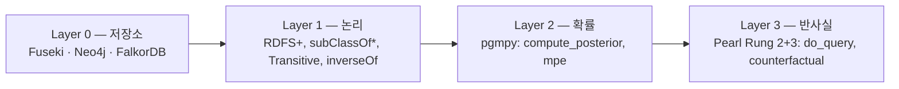

# ontorag

**OWL 네이티브 온톨로지 기반 RAG 프레임워크 — 온톨로지를 단일 진실 원천(source of truth)으로.**

일반적인 RAG(청크 + 임베딩)와 달리, ontorag는 **RDF/OWL 온톨로지**를 검색
기반으로 사용합니다. LLM 에이전트는 근사 벡터 검색이 아닌 **타입이 명확한
MCP 툴**을 통해 그래프를 탐색하며, 그 위에 **확률**(베이지안) 및
**인과**(Pearl Rung 2 + 3) 추론 레이어가 얹혀 있습니다.

---

## 왜 ontorag인가

|                | Vector RAG          | GraphRAG (MS)       | **ontorag**                       |
|----------------|---------------------|---------------------|-----------------------------------|
| 진실 원천      | 청크 + 임베딩       | 추출된 KG           | **사용자 정의 OWL 스키마**         |
| 스키마         | 없음                | 평탄 프로퍼티 그래프 | **`rdfs:subClassOf`, `owl:TransitiveProperty`, `owl:inverseOf`** |
| 추론           | 유사도              | 커뮤니티 요약       | **논리 + 확률 + 인과**             |
| LLM 인터페이스 | 검색된 청크         | 텍스트 요약         | **타입 MCP 툴 (raw SPARQL 미노출)** |
| 백엔드         | 단일 벡터 스토어     | 단일 그래프         | **Fuseki / Neo4j / FalkorDB** (parity 검증) |

## 4-레이어 추론 스택

각 레이어는 *다른 종류의* 질문에 답합니다:

- **논리** — *"X가 반드시 참인가?"*
- **확률** — *"X가 일어날 확률은?"*
- **반사실** — *"Y에 개입했다면? Y가 달랐다면?"*

학습 레이어(GNN / R-GCN)는 의도적으로 **v1.1+로 연기**되었습니다.

## 핵심 보장 (v1.0)

- **3-백엔드 parity** — Fuseki / Neo4j / FalkorDB 사이에 프로토콜 메트릭
  7/7이 완전 일치 (`full_parity = True`). [Benchmark](https://github.com/nuri428/ontorag/blob/main/docs/BENCHMARK_v1.md) 참조.
- **인과 정직성(causal honesty)** — 모든 `do_query`가 백도어 보정 집합과
  "왜 do ≠ see인지" 트레이스를 함께 반환 (흡연 예제: P(Cancer | **see** Smoking) = 0.72
  vs P(Cancer | **do** Smoking) = 0.60).
- **LLM에는 raw SPARQL을 노출하지 않음** — 에이전트는 타입이 명확한 MCP 툴만 봅니다.

## 다음으로

- [빠른 시작](quickstart.md) — 5분 안에 설치 + 첫 질의.
- [CLI 레퍼런스](cli.md) — 모든 `ontorag` 서브커맨드.
- [MCP & 툴](mcp.md) — 18개 타입 툴 + Claude Desktop / Cursor용 stdio 서버.
- [추론 레이어](reasoning.md) — 베이지안 + 인과 예제.
- [변경 이력](changelog.md) — 릴리스 히스토리.

!!! tip "언어"
    우상단의 언어 전환기로 English / 한국어를 토글할 수 있습니다.
