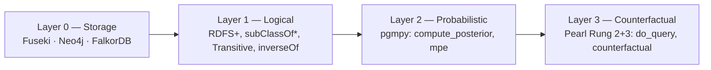

# ontorag

**OWL-native, ontology-aware RAG framework — ontology as the source of truth.**

Unlike typical RAG (chunks + embeddings), ontorag treats the **RDF/OWL ontology** as
the retrieval substrate. An LLM agent navigates that graph through **typed MCP
tools** instead of approximate vector search — with **probabilistic** (Bayesian)
and **causal** (Pearl Rung 2 + 3) reasoning layered on top.

---

## Why ontorag

|                | Vector RAG          | GraphRAG (MS)       | **ontorag**                       |
|----------------|---------------------|---------------------|-----------------------------------|
| Source of truth | chunks + embeddings | extracted KG        | **user-supplied OWL schema**      |
| Schema         | none                | flat property graph | **`rdfs:subClassOf`, `owl:TransitiveProperty`, `owl:inverseOf`** |
| Reasoning      | similarity          | community summary   | **logical + probabilistic + causal** |
| LLM interface  | retrieved chunks    | text summaries      | **typed MCP tools (SPARQL never exposed)** |
| Backends       | one vector store    | one graph           | **Fuseki / Neo4j / FalkorDB** (parity proven) |

## The 4-layer reasoning stack

Each layer answers a different *kind* of question:

- **Logical** — *"Is X necessarily true?"*
- **Probabilistic** — *"How likely is X?"*
- **Counterfactual** — *"What if we intervened on Y? What if Y had been different?"*

A learning layer (GNN / R-GCN) is **deferred to v1.1+** by design.

## Headline guarantees (v1.0)

- **3-backend parity** — 7/7 protocol metrics identical across Fuseki / Neo4j /
  FalkorDB (`full_parity = True`). See [Benchmark](https://github.com/nuri428/ontorag/blob/main/docs/BENCHMARK_v1.md).
- **Causal honesty** — every `do_query` carries its back-door adjustment set and
  a "why do ≠ see" trace (smoking example: P(Cancer | **see** Smoking) = 0.72
  vs P(Cancer | **do** Smoking) = 0.60).
- **No raw SPARQL to the LLM** — the agent only sees typed MCP tools.

## Where to go next

- [Quickstart](quickstart.md) — install + first query in under 5 minutes.
- [CLI reference](cli.md) — every `ontorag` subcommand.
- [MCP & Tools](mcp.md) — 18 typed tools + stdio MCP server for Claude Desktop / Cursor.
- [Reasoning](reasoning.md) — Bayesian + Causal worked examples.
- [Changelog](changelog.md) — release history.

!!! tip "Language"
    Use the language switcher (top right) to toggle between English and 한국어.
