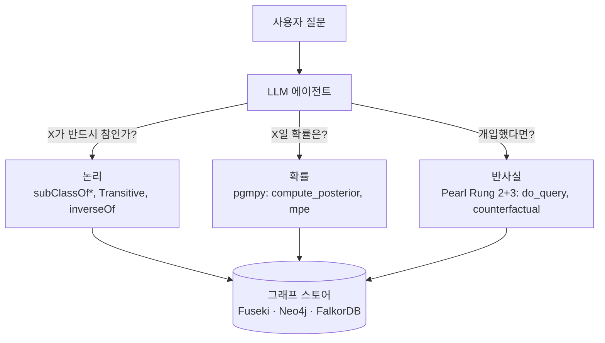

# 추론 레이어

ontorag의 핵심 차별점: 온톨로지는 단순히 저장되는 것이 아니라 — 세 가지
수준에서 *추론됩니다*.



세 레이어 모두 **타입 MCP 툴**을 노출하고 같은 백엔드를 공유하며, v1.0
벤치마크는 Fuseki / Neo4j / FalkorDB에서 동일한 수치를 증명합니다.

## 논리 (항상 활성)

모든 read 툴(`find_entities`, `count_entities`, `traverse_graph` …)은 OWL
의미를 존중합니다:

- `rdfs:subClassOf*` — `find_entities(Animal)`이 Dog/Cat 인스턴스도 반환.
- `owl:TransitiveProperty` — `traverse_graph`가 전이 술어를 따라감.
- `owl:inverseOf` — `describe_entity`가 양방향 표시.

구현은 백엔드마다 다릅니다 (Fuseki: 쿼리 레벨 SPARQL `subClassOf*`; Neo4j:
n10s 위의 Cypher `[:rdfs__subClassOf*]`; FalkorDB: 커스텀 로더 위의 동일한
Cypher) — 그러나 관찰 가능한 결과는 동일합니다.

## 확률 — 베이지안 네트워크 (v0.7, `[bayes]` extra)

CPT는 `urn:ontorag:probabilistic` 명명된 그래프에 저장됩니다 — 스키마/데이터
그래프에 절대 섞이지 않습니다.

### CLI

```bash
ontorag bayes load        examples/pokemon/bayes.ttl
ontorag bayes show
ontorag bayes posterior   --evidence "OpponentType=Water" --query "BattleOutcome"
ontorag bayes mpe         --evidence "OpponentType=Water"
ontorag bayes learn-cpt   --data-class Pokemon          # ABox에서 CPT 학습
```

### MCP 툴

- `compute_posterior(evidence, query)` — `P(Q | E)`.
- `mpe(evidence)` — 가장 가능성 높은 설명 (argmax joint).

### 라이브러리

**pgmpy** (Python-native, MIT)가 단일 엔진입니다. `asyncio.to_thread`로
async 친화적. OpenMarkov는 거부됨 (Java GUI). 성능 fallback으로 pyAgrum
보유.

## 반사실 — 인과 추론 (v0.8)

DAG는 `urn:ontorag:causal`에 저장됩니다 — BN과 분리.

### Pearl Rung 2 (개입)

```bash
ontorag causal load examples/smoking/causal.ttl
ontorag causal do   --do "Smoking=yes" --query "Cancer"
```

`do_query`는 pgmpy `CausalInference.query(do=…)`를 사용합니다 — 그래프 수술
+ 자동 백도어 보정.

### Pearl Rung 3 (반사실)

```bash
ontorag causal counterfactual \
    --observed "Smoking=yes,Cancer=yes" \
    --do       "Smoking=no" \
    --query    "Cancer"
```

CPT와 일관된 정칙(canonical) 독립-노이즈 SCM 위에서 **abduction · action ·
prediction** (response-function 열거)으로 구현됩니다.

### Identification

```bash
ontorag causal identify --treatment Smoking --outcome Cancer
```

최소 백도어 집합 + 모든 프론트도어 보정 집합을 반환합니다
(`get_minimal_adjustment_set` / `get_all_frontdoor_adjustment_sets`).

### v1.1 — 답변 설명가능성

이제 `do_query`가 자체 근거를 함께 반환합니다:

```json
{
  "distribution": { "Cancer=yes": 0.60, "Cancer=no": 0.40 },
  "adjustment":   { "Smoking → Cancer": ["Genotype"] },
  "explanation":  "do(Smoking=yes) differs from see(Smoking=yes) because Genotype is a confounder; back-door adjusted over {Genotype}."
}
```

MCP 툴, REST 라우트, Reasoning WebUI(do() 막대 아래의 "why:" 트레이스)에
모두 노출됩니다.

## 종합 예제 — 흡연 BN

교과서적 *see ≠ do* 격차를 엔드투엔드로 재현:

| 질의 | 값 |
|---|---|
| P(Cancer) — 주변확률 | **0.43** |
| P(Cancer \| **see** Smoking = yes) | **0.72** |
| P(Cancer \| **do** Smoking = yes) — {Genotype} 백도어 | **0.60** |
| 반사실 P(Cancer \| 관측 Smoking=yes, Cancer=yes; do Smoking=no) | **0.28** |
| 백도어 보정 집합 | `{Genotype}` |

다섯 값 모두 `tests/test_causal_engine.py`에서 손으로 검증되며 다음으로
실행 가능합니다:

```bash
ontorag eval reasoning examples/smoking/reasoning_goldset.jsonl
```

러너는 첫 실행에서 goldset 자체의 잘못된 사전확률(P(Cancer)이 0.5가 아닌
0.43)을 잡아냈습니다 — 확률 인프라가 가능케 하는 정확한 자가 점검의 사례.

## 정직성 노트

!!! warning "Over-claim guard (과대주장 방지)"
    인과 DAG는 **사용자가 제공**합니다. ontorag는 DAG가 올바르게
    명시되었다는 가정 하에 개입 및 반사실 질의를 계산하며 — 인과 의미를
    *검증*하거나 인과를 *발견*하지는 않습니다. 구조 발견(`learn-dag`)은
    제안만 출력하며 자동 커밋되지 않습니다.

!!! info "학습 레이어는 연기됨"
    GNN / R-GCN 학습 레이어 (link prediction, neural CPT, structure
    learning)는 **v1.1+로 연기**되었습니다. ontorag는 v1.x 동안
    "training-free"를 유지합니다 — 누락이 아닌 의도된 결정.

## 더 읽기

- 설계 — `docs/design/bayesian-layer.md`
- 설계 — `docs/design/causal-layer.md`
- 벤치마크 — `docs/BENCHMARK_v1.md` (parity 증명)
- 소스 — `src/ontorag/bayes/`, `src/ontorag/causal/`
