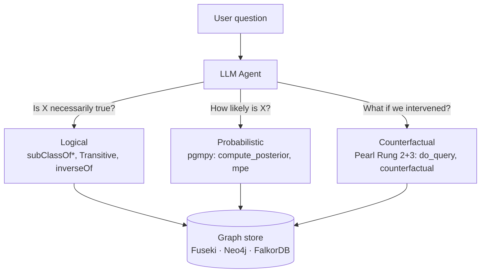

# Reasoning Layer

ontorag's headline differentiator: the ontology is not just stored — it is
*reasoned over* at three levels.



All three layers expose **typed MCP tools**, share the same backend, and the
v1.0 benchmark proves identical numerical results across Fuseki / Neo4j /
FalkorDB.

## Logical (always-on)

Every read tool (`find_entities`, `count_entities`, `traverse_graph`, …)
honours OWL semantics:

- `rdfs:subClassOf*` — `find_entities(Animal)` returns Dog/Cat instances.
- `owl:TransitiveProperty` — `traverse_graph` follows transitive predicates.
- `owl:inverseOf` — `describe_entity` surfaces both directions.

Implementation differs by backend (Fuseki: query-level SPARQL `subClassOf*`;
Neo4j: Cypher `[:rdfs__subClassOf*]` via n10s; FalkorDB: the same Cypher over
the custom loader), but observable results are identical.

## Probabilistic — Bayesian Networks (v0.7, `[bayes]` extra)

CPTs live in the `urn:ontorag:probabilistic` named graph — never in the
schema/data graphs.

### CLI

```bash
ontorag bayes load        examples/pokemon/bayes.ttl
ontorag bayes show
ontorag bayes posterior   --evidence "OpponentType=Water" --query "BattleOutcome"
ontorag bayes mpe         --evidence "OpponentType=Water"
ontorag bayes learn-cpt   --data-class Pokemon          # learn CPTs from ABox
```

### MCP tools

- `compute_posterior(evidence, query)` — `P(Q | E)`.
- `mpe(evidence)` — most-probable explanation (argmax joint).

### Library

**pgmpy** (Python-native, MIT) is the single engine. Async-friendly via
`asyncio.to_thread`. OpenMarkov was rejected (Java GUI). pyAgrum reserved as a
performance fallback.

## Counterfactual — Causal Inference (v0.8)

DAG lives in `urn:ontorag:causal` — separate from the BN.

### Pearl Rung 2 (interventional)

```bash
ontorag causal load examples/smoking/causal.ttl
ontorag causal do   --do "Smoking=yes" --query "Cancer"
```

`do_query` uses pgmpy `CausalInference.query(do=…)` — graph surgery +
automatic back-door adjustment.

### Pearl Rung 3 (counterfactual)

```bash
ontorag causal counterfactual \
    --observed "Smoking=yes,Cancer=yes" \
    --do       "Smoking=no" \
    --query    "Cancer"
```

Implemented via **abduction · action · prediction** over the canonical
independent-noise SCM consistent with the CPTs (response-function
enumeration).

### Identification

```bash
ontorag causal identify --treatment Smoking --outcome Cancer
```

Returns the minimal back-door set + every front-door adjustment set
(`get_minimal_adjustment_set` / `get_all_frontdoor_adjustment_sets`).

### v1.1 — answer explainability

`do_query` now returns its own justification:

```json
{
  "distribution": { "Cancer=yes": 0.60, "Cancer=no": 0.40 },
  "adjustment":   { "Smoking → Cancer": ["Genotype"] },
  "explanation":  "do(Smoking=yes) differs from see(Smoking=yes) because Genotype is a confounder; back-door adjusted over {Genotype}."
}
```

Surfaced through the MCP tool, REST route, and the Reasoning WebUI (a "why:"
trace under the `do()` bars).

## Worked example — Smoking BN

The textbook *see ≠ do* gap, reproduced end-to-end:

| Query | Value |
|---|---|
| P(Cancer) — marginal | **0.43** |
| P(Cancer \| **see** Smoking = yes) | **0.72** |
| P(Cancer \| **do** Smoking = yes) — back-door over {Genotype} | **0.60** |
| Counterfactual P(Cancer \| observed Smoking=yes, Cancer=yes; do Smoking=no) | **0.28** |
| Back-door adjustment set | `{Genotype}` |

All five are hand-verified in `tests/test_causal_engine.py` and runnable via:

```bash
ontorag eval reasoning examples/smoking/reasoning_goldset.jsonl
```

The runner caught a wrong prior in the goldset itself on its first run
(P(Cancer) was 0.5; engine-verified value is 0.43) — exactly the kind of
self-check that probabilistic infrastructure makes possible.

## Honesty notes

!!! warning "Over-claim guard"
    The causal DAG is **user-supplied**. ontorag computes interventional and
    counterfactual queries assuming the DAG is correctly specified — it does
    *not* validate causal semantics or discover causation. Structure
    discovery (`learn-dag`) emits proposals only, never auto-committed.

!!! info "Learning layer is deferred"
    A GNN / R-GCN learning layer (link prediction, neural CPT, structure
    learning) is **deferred to v1.1+**. ontorag stays "training-free"
    through v1.x — by design, not by oversight.

## Further reading

- Design — `docs/design/bayesian-layer.md`
- Design — `docs/design/causal-layer.md`
- Benchmark — `docs/BENCHMARK_v1.md` (the parity proof)
- Source — `src/ontorag/bayes/`, `src/ontorag/causal/`
